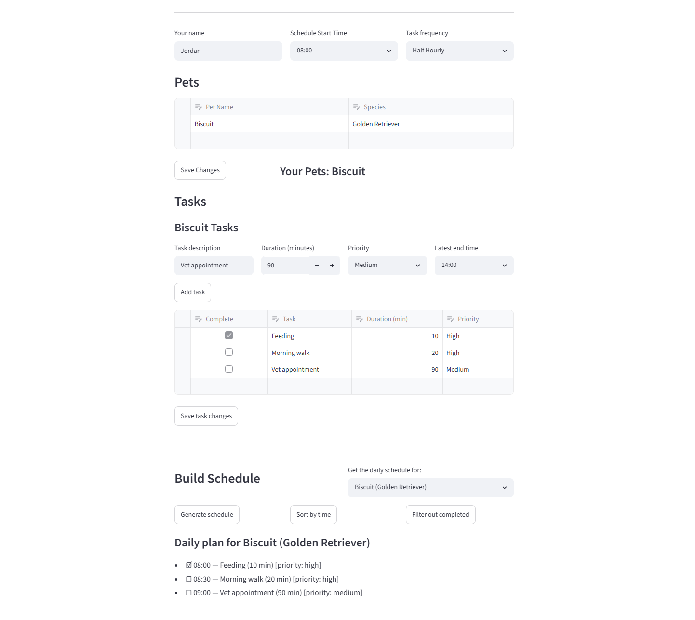
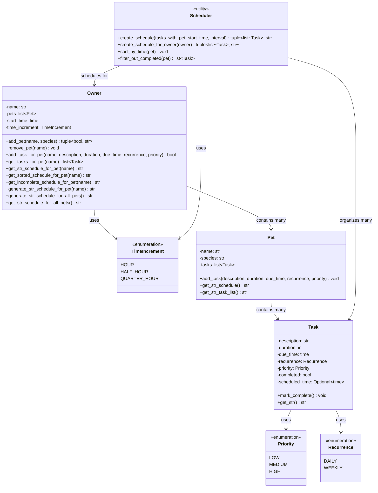

# PawPal+ (Module 2 Project)

Welcome to **PawPal+**, a Streamlit app that helps a pet owner plan care tasks for their pet.

## Features

**Priority-Based Task Scheduling** — Tasks are intelligently scheduled by priority level (HIGH → MEDIUM → LOW), then by due_time, with configurable time increments (hourly, half-hourly, quarterly), ensuring high-priority tasks are always scheduled first and complete before their deadline.

**Conflict Detection & Smart Skipping** — The system automatically detects when tasks cannot fit within their due_time window and skips them with a detailed conflict report showing pet name, task details, duration, and priority, allowing owners to adjust schedules accordingly.

**Interactive Multi-Pet Dashboard** — A Streamlit app provides real-time pet and task management with dynamic schedule generation, filtering by completion status, sorting by time, and support for managing multiple pets in a single unified interface.

## Scenario

A busy pet owner needs help staying consistent with pet care. They want an assistant that can:

- Track pet care tasks (walks, feeding, meds, enrichment, grooming, etc.)
- Consider constraints (time available, priority, owner preferences)
- Produce a daily plan and explain why it chose that plan

Your job is to design the system first (UML), then implement the logic in Python, then connect it to the Streamlit UI.

## What got built

- Let a user enter basic owner + pet info
- Let a user add/edit tasks (duration + priority at minimum)
- Generate a daily schedule/plan based on constraints and priorities
- Display the plan clearly (and ideally explain the reasoning)
- Include tests for the most important scheduling behaviors

## Getting started

### Setup

```bash
python -m venv .venv
source .venv/bin/activate  # Windows: .venv\Scripts\activate
pip install -r requirements.txt
```

### Suggested workflow

1. Read the scenario carefully and identify requirements and edge cases.
2. Draft a UML diagram (classes, attributes, methods, relationships).
3. Convert UML into Python class stubs (no logic yet).
4. Implement scheduling logic in small increments.
5. Add tests to verify key behaviors.
6. Connect your logic to the Streamlit UI in `app.py`.
7. Refine UML so it matches what you actually built.

## 🖥️ Sample Output

Paste a sample of your app's CLI or Streamlit output here so a reader can see what a generated plan looks like:

```
==================================================
Today's Schedule for Alice
==================================================
#### Daily plan for Biscuit (Golden Retriever)
  - ☐ unscheduled — Morning walk (30 min) [priority: high]
  - ☐ unscheduled — Lunch and playtime (45 min) [priority: medium]
  - ☐ unscheduled — Evening walk (30 min) [priority: high]
#### Daily plan for Whiskers (Siamese Cat)
  - ☐ unscheduled — Feeding (15 min) [priority: high]
  - ☐ unscheduled — Litter box cleaning (10 min) [priority: medium]
==================================================
```

## 🧪 Testing PawPal+

Tests verify the three core user tasks: adding pets, scheduling tasks, and viewing schedules. They validate data integrity through sorting (chronological order, priority-based), filtering (completed tasks), and conflict detection (tasks that can't fit before due times). Coverage spans single and multi-pet scenarios with edge cases for empty states and scheduling constraints.

```bash
# Run the full test suite:
python -m pytest tests/test_pawpal.py -v

# Run with coverage:
pytest --cov
```

Sample test output:

```
================================== test session starts ==================================
platform win32 -- Python 3.13.1, pytest-9.0.3, pluggy-1.6.0 -- C:\Python313\python.exe
cachedir: .pytest_cache
rootdir: C:\Users\isayi\CLASSES\AI110\ai110-module2show-pawpal-starter
plugins: anyio-4.13.0
collected 24 items                                                                       

tests/test_pawpal.py::test_add_pet PASSED                                          [  4%]
tests/test_pawpal.py::test_add_multiple_tasks_to_pet PASSED                        [  8%]
tests/test_pawpal.py::test_add_tasks_to_multiple_pets PASSED                       [ 12%]
tests/test_pawpal.py::test_view_schedule_for_single_pet PASSED                     [ 16%]
tests/test_pawpal.py::test_view_schedule_for_all_pets PASSED                       [ 20%]
tests/test_pawpal.py::test_tasks_sorted_by_scheduled_time PASSED                   [ 25%]
tests/test_pawpal.py::test_unscheduled_tasks_appear_last PASSED                    [ 29%]
tests/test_pawpal.py::test_sort_by_priority_then_due_time PASSED                   [ 33%]
tests/test_pawpal.py::test_task_completion PASSED                                  [ 37%]
tests/test_pawpal.py::test_filter_out_completed_tasks PASSED                       [ 41%]
tests/test_pawpal.py::test_filter_with_all_tasks_complete PASSED                   [ 45%]
tests/test_pawpal.py::test_filter_with_no_tasks_complete PASSED                    [ 50%]
tests/test_pawpal.py::test_add_tasks_to_pet PASSED                                 [ 54%]
tests/test_pawpal.py::test_filtering_does_not_modify_original PASSED               [ 58%]
tests/test_pawpal.py::test_detect_task_cannot_fit_before_due_time PASSED           [ 62%]
tests/test_pawpal.py::test_detect_overlapping_scheduled_tasks PASSED               [ 66%]
tests/test_pawpal.py::test_conflict_detection_across_multiple_pets PASSED          [ 70%]
tests/test_pawpal.py::test_no_conflicts_with_properly_spaced_tasks PASSED          [ 75%]
tests/test_pawpal.py::test_skipped_task_report_includes_details PASSED             [ 79%]
tests/test_pawpal.py::test_task_get_str_incomplete PASSED                          [ 83%]
tests/test_pawpal.py::test_task_get_str_complete PASSED                            [ 87%]
tests/test_pawpal.py::test_task_get_str_unscheduled PASSED                         [ 91%]
tests/test_pawpal.py::test_schedule_uses_get_str_method PASSED                     [ 95%]
tests/test_pawpal.py::test_incomplete_schedule_uses_get_str_method PASSED          [100%]

================================== 24 passed in 0.06s ===================================
```
- Confidence Level 5/5 system reliablity, thorough tests

## 📐 Smarter Scheduling

| Feature | Method(s) | Notes |
|---------|-----------|-------|
| Task sorting | `Scheduler._task_sort_key()`, `Scheduler.sort_by_time()`, `Scheduler.create_schedule()` | Primary sort by priority (high to low); secondary sort by due_time (early to late) |
| Filtering | `Scheduler.filter_out_completed()`, `Scheduler.create_schedule()` | Filter out completed tasks, skip tasks that can't fit before their due_time |
| Conflict handling | `Scheduler.create_schedule()`, `Scheduler._format_skipped_tasks()` | Detects when tasks conflict with time slots; generates skipped task summary with reason |
| Recurring tasks | `Task.frequency` property, `Recurrence` enum (DAILY/WEEKLY) | Frequency and recurrence stored on each task |

## 📸 Demo Walkthrough

1. Add your name and timing preferences, including your start time and scheduling frequency.
2. Add your pet(s), including name and species.
3. For each pet, add related tasks. You can set the description, duration, priority, and due time.
4. You can edit, delete, and mark tasks complete in the table.
5. At the bottom, you can generate schedules for one or all your pets.
6. For the single-pet view, you can sort by time and filter out completed tasks.

**Screenshot or video** *(optional)*:


# System Architecture
